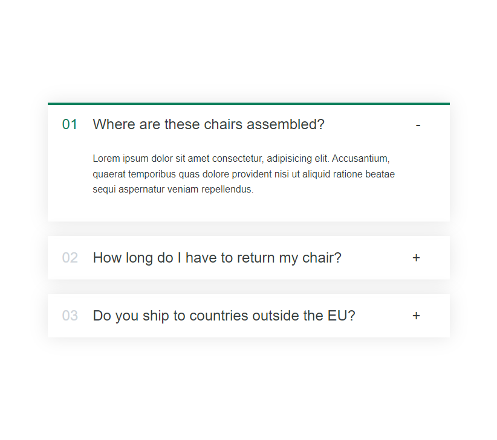

# React Accordion FAQ React App 📚❓

>)

-This project was bootstrapped with [Create React App](https://github.com/facebook/create-react-app).

## Description

This is a small React application I built as part of my practice. It's a simple FAQ accordion that lets users click on questions to reveal or hide their answers. The app is part of a series of small projects I’m working on to strengthen my React skills. 🚀

## Features

- **Accordion Functionality**: Expand and collapse questions to reveal answers. 🔄
- **State Management**: Handled with React's `useState` hook. 🔧
- **Conditional Rendering**: Dynamically displays content based on user interaction. ⚡️
- **Array Mapping**: Used to generate multiple FAQ items from a data array. 📝

## Key Concepts Practiced

- ⚛️ React components and their interaction.
- 🔄 State management using `useState`.
- 👆 Handling user events like clicks.
- 🗂️ Rendering lists of elements by mapping through data.
- 👁️‍🗨️ Conditional rendering to show or hide parts of the UI.

## My Learning Journey

This is just one of the small applications I've built while learning React. I'm practicing the basics and getting comfortable with components, state, and rendering patterns. More to come as I keep progressing! 💻📈

## Live Demo

- [Live Preview Here](https://accordion-questions-mo3bassias-projects.vercel.app)
